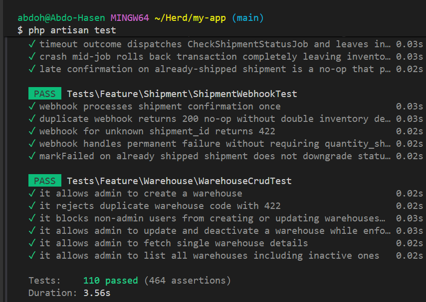

# Warehouse Inventory Reservation Engine

An API-first backend system built with **Laravel 12** and **MySQL** that manages inventory reservations across multiple warehouses with strict concurrency guarantees, idempotent operations, and an append-only audit trail.

---

## 🚀 Features

- **Inventory Allocation Engine**: Reserve stock per warehouse with pessimistic database locks (`lockForUpdate()`) and structural DB safety net constraints (`CHECK (quantity_available >= 0)`).
- **Reservation Lifecycle**: Full workflow tracking from `OPEN` → `PICKED` → `PACKED` → `SHIPPED` (or `EXPIRED` / `RELEASED`).
- **Idempotency & Replay Protection**: API request replay protection via `Idempotency-Key` headers and webhook deduplication.
- **Asynchronous Shipment Engine**: Mock shipping provider supporting instant success, failure, timeout, delayed webhooks, and status polling jobs.
- **Inter-Warehouse Transfers**: Move stock between warehouses with ascending row-locking order to prevent database deadlocks.
- **Append-Only Audit Ledger**: Detailed `inventory_movements` and `reservation_histories` for end-to-end traceability.
- **Role-Based Access Control (RBAC)**: Sanctum token auth with 3 roles: `admin`, `order_creator`, and `warehouse_operator`.

---

## 🛠️ Stack & Prerequisites

- **Framework**: Laravel 12 (PHP 8.2+)
- **Database**: MySQL 8.0+
- **Authentication**: Laravel Sanctum
- **Test Framework**: Pest (112 Feature Tests, 469 Assertions)

---

## 📦 Installation & Setup

1. **Clone & Install Dependencies**:
   ```bash
   git clone <repository-url>
   cd my-app
   composer install
   ```

2. **Environment Configuration**:
   ```bash
   cp .env.example .env
   php artisan key:generate
   ```

3. **Database & API Key Configuration**:
   Configure database credentials and set `APP_API_KEY` in `.env` (any secret string for API header auth):
   ```env
   APP_API_KEY=example_secret_app_key_123
   ```
   Run database migrations and seeders:
   ```bash
   php artisan migrate --seed
   ```

4. **Serve Application**:
   ```bash
   php artisan serve
   ```

5. **Run Queue Worker (Async Shipment Engine)**:
   ```bash
   php artisan queue:work
   ```

---

## 🧪 Running Tests

Run the complete Pest test suite:

```bash
php artisan test
```

To run tests filtered by specific feature module:

```bash
php artisan test --filter=ReservationTest
```

---

## ⏰ Automated Tasks

### Reservation Expiration
Automatically expire open reservations older than 30 minutes and restore inventory:

```bash
php artisan inventory:expire-reservations
```

---

## 📚 Documentation

- [Architecture & Design (`Docs/ARCHITECTURE.md`)](Docs/ARCHITECTURE.md) — Detailed breakdown of domain entities, state machines, locking mechanisms, and scaling trade-offs.
- [AI Usage Log (`Docs/AI_USAGE.md`)](Docs/AI_USAGE.md) — Log of AI pair-programming usage, system rules, human engineering decisions, and trade-offs.

---

## ⚙️ Assumptions & Known Limitations

- **Single-Warehouse-per-Line**: Each order item line is reserved from one specific warehouse to keep allocations deterministic.
- **Pessimistic Row Locking**: Uses DB-level pessimistic locks (`lockForUpdate()`), suitable for single-database instances. Scale out to distributed locks (Redis / Redlock) is planned for ultra-high throughput environments.

---

## 📸 Evidence

### Test Suite Execution

- **112 Passed** (469 assertions)
- **Duration**: ~3.61s

